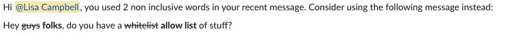

# Taylor's website

This website is written in HTML and CSS.

Taylor is an open source project, at this time is only available through [Taylor's site](https://gettaylor.app/). Taylor is still in the process of Slack's review process.

## What is Taylor?
Taylor is a non binary, non gender Slack bot that can be installed in any Slack workspace. 
Taylor will send alerts to any users who have used a term that is not inclusive and provides and alternative to their message.

